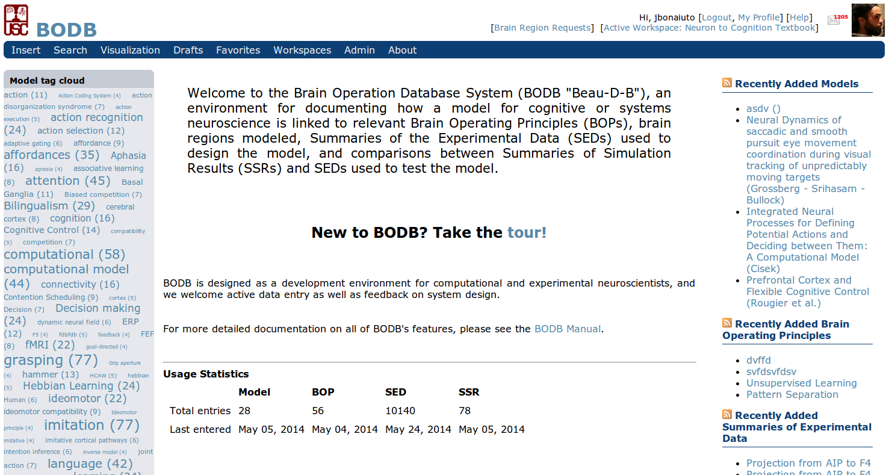

BODB Structure
===================

    BODB main page

The main page contains a toolbar (top), user information (top right), and tag cloud sections (left) which are visible on every page. It also contains a new entries section (right) and usage statistics (middle) that are only visible on the main page.

Toolbar
-------

The toolbar contains the options Insert, Search, Visualization, Drafts, Favorites, Workspace, About, and depending on the user's level of access, Admin.

* Insert allows users to insert new Literature, Brain Operating Principles (BOP), Model, or Summary of Experimental Data (SED) records 
* Search allows the user to search all BODB records 
* Visualization opens Brainsurfer, a three-dimensional visualization tool for human and brain atlases where the user can view coordinates associated with Brain Imaging SEDs 
* Drafts allows users to view and edit current records that they are working on
* Favorites does something with Active Coordinates
* Workspace allows users to workon and adminster their Collaborative Workspaces (CoWos)
* About leads to the page describing the history of BODB and its implementors 
* Admin allows administrators to manage other users and brain atlases

User Information
----------------

The user information section displays the user's avatar (this can be set on the User Profile page) and provides the following options: Logout, My Profile, Messages, and Help. If there are any unread messages in the user's inbox, the number is displayed here.

* Logout logs the user out of the system 
* My Profile allows the user to view and modify their profile 
* Messages allows the user to read and write messages to other BODB users 
* Help opens the appropriate help page 

Tag Cloud
---------

The tag cloud section displays the tags associated with Model, BOP, SED, Prediction, and Summary of Simulation Results (SSR) entries. The relative font size of each tag indicates the number of entries it is associated with and this number is also displayed in parenthesis after the tag name. Clicking on a tag opens a page listing all the entries associated with it. The tag cloud section can be hidden by clicking on the "<" link in the middle to the right of the column. When hidden, this will change to a ">" link that can be clicked on to display the section again.

New Entries
-----------

The new entries section displays the five most recently added Model, BOP, SED, and SSR entries. For each section, the orange RSS icon to the left of the section header can be clicked on for the RSS subscription feed. This can be used in any news ticker or news reading program (such as Google Reader) to get automatic updates of the latest BODB entries.
