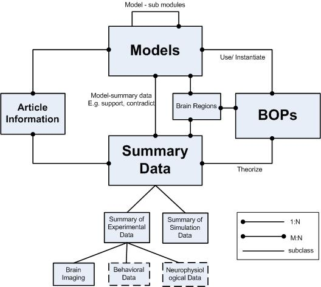

Conceptual Overview
===================

Advances in neuroscientific research have led to a flood of information that can only be structured and navigated with the aid of databases and the technology of the World Wide Web. As one contribution to channeling this flood, we are developing BODB to facilitate the interchange between those developing new brain models and those developing new experiments. The current ideas are that the system 

#. houses capsules of neuroscientific literature information that will facilitate comparison and integration of original articles; 
#. provides a standard form and repository for entering BOPs; 
#. provides a standard form and repository for entering Model summaries; 
#. supplies a sharing point for the data in (1,2,3) among users to enhance knowledge development; 
#. provides a repository of experimental data with a standard structure, and the experimental-data and cross-experiment data analysis tools (currently our focus is on brain imaging data); and 
#. provides a means to connect related documents together with practical search tools to enhance the accessibility of information. 

These features are intended for use by both brain modelers and brain experimenters. The experimental data and analysis tools will be used by the brain modeler in extracting knowledge and developing new models, and by the experimenter in designing further experimental protocols. Furthermore, the BOP and Model entries will supply knowledge for the modeler to construct new models, and provide the experimenter suggestions to contrive new experiments. Consequently, the implementation and integration of these features would enhance a theory-experiment cycle (Arbib, 2001).

Our current version of BODB combines features of an SDB (Summary Database) and Model Repository (as in Brain Models on the Web [BMW], Bischoff-Grethe, Spoelstra & Arbib, 2001), supplemented with a variety of new features. The system provides data entities for storing article information, brain operating principles, models, generic summary data, brain-imaging experimental data, and, finally , their relations.

    The entity relationship schema of BODB’s fundamental entities.
    
Brain Operating Principle
-------------------------
In BODB, a Brain Operating Principle is a generalized description of an "operating principle" common to a range of functions (schemas) or structures (regions, circuits, neurons, etc.) of the brain. At the micro-level, the principle could describe electro-chemical dynamics; at the macro-level, it might describe the activity of multiple groups of cells achieving some task by competitive and/or cooperative means.

In general, a principle specific to the operation of a single model does not count as a BOP. Rather, it should simply be part of the description of the relevant model. The same applies to a principle describing a single functionality of a brain region as modeled by a set of alternate models. The whole idea of BOPs is to let one search for models which are related by “how they work” (a functional ontology) rather than by the brain regions they model (a structural ontology). Clearly, a principle specific to one model or to very similar models does not serve this purpose (though there may be very rare exceptions).

One example of a Brain Operating is the Winner-Take-All (WTA) Principle, which asserts that "A Winner-Take-All network responds (after a delay) to an array of inputs of different intensity with an output array which encodes which input had the greatest intensity." This BOP applies to aspects of the operation of a varied range of models. These include: (i) The Prey-Selector Model of Didday (1976) which models the frog’s tectum as a Winner-Take-All network that selects one of several visually presented prey objects. (ii) The Dominey and Arbib (1992) model of the control of saccades: The superior colliculus is modeled as a WTA for selecting among a set of retinotopically coded targets. (iii) Self-Organizing feature Maps (Kohonen, 1982): At each training trial, the WTA selects the neuron that responds best, then provides a Hebbian adjustment to nearby neurons in relation to the current stimulus, with the size of the synaptic change decaying with distance from the winner. (iv) The Taxon-Affordance Model (Guazzelli et al., 1998): Premotor cortex combines maps of affordances, incentives and expected reinforcement and then applies a WTA to choose a particular affordance. (v) The basal ganglia based model (Redgrave, Prescott and Gurney, 1999) for selecting one of several competing actions. (vi) The Itti & Koch (2000) model of visual attention which applies WTA to a sum of feature maps to locate the most location in a given scene.

Article Information
-------------------
This is quite standard, functioning as a bibliography, keeping information on publications cited in other entries in BODB. As usual, each item is categorized into one of 7 types: journal, book, chapter, thesis, conference, electronic, and unpublished. Brain Operating Principle (BOP): This originated from the observation that key concepts concerning brain mechanisms are sometimes implicit in many references but integrated in none. The Brain Operating Principle entity is designed to serve as a repository for maintaining structured and succinct concepts about “how the brain (or a key - functional or structural - subsystem) works”, whether extracted and generalized from empirical data, or exemplified in computational models. We designed this entity with the m:n relationship linking to Article information since one brain operating principle could be derived from many articles, while one article could be a source of information for two or more principles.

Model
-----
This is designed to function as a repository for descriptions of computational models of brain mechanisms with fields available to provide linkages to actual implementations, simulations, documentation and descriptions. We designed this entity, too, with the m:n relationship to Article information. Another m:n relationship links the Model and Brain Operating Principle entities because one model could be derived from many principles, while one principle could be exemplified in many models. Since one model could be synthesized from other models, the m:n self-relationship is also supplied to this entity.

Brain Region
------------
This entity contains names and hierarchies of regions of the human brain, currently based on data from the Research Imaging Center, The University of Texas Health Science Center at San Antonio. These brain region names are used to categorize entries related to specific human brain regions, enhancing entry-search capability.

Summaries of Empirical Data and Simulation Results
--------------------------------------------------
BODB provides forms for two types of summaries: one for summarizing experimental data (SED) and the other for summarizing simulation results (SSR). For SEDs, BODB currently provides generic forms to contribute to a repository for summarizing related facts, experimental settings and results from one or several publications. A specific form for brain imaging experimental data (see below) is also provided. For SSRs, BODB provides only a generic form for use in documenting each related set of key findings associated with a model. Each SED is amenable for use to support the design of a model or to be used in testing a model - whose SSRs may explain the SED or be contradicted by SEDs. The latter situation may either be used to downgrade confidence in the model or to point the way to further efforts that build on the current model.

Brain Imaging Experimental Data
-------------------------------
Currently, this entity provides the one specifically structured type of Summary of Experimental Data for BODB. It serves primarily as a repository for tables of brain-imaging experimental data. We adapted the Talairach Daemon (TD) developed by the San Antonio group as well as ideas from USCBP’s own NeuARt project (Dashti et al., 2001) to enable the user to graphically compare and contrast the experimental data on brain-slice images. One brain imaging article could have two or more experiment sets, and almost every brain imaging experiment will relate to multiple brain regions.

In addition to the basic entities described so far, we added a set of tables that are responsible for maintaining block diagrams for models and anatomical relationships, etc., with supplementary information such as box area (coordinates) and box name. These diagrams not only help the user visualize Model entries, but also provide connections between Models via hierarchical relations.

Connections among entities not only allow the user to go back and forth between entries via their relations, but provide options for cross search as well (e.g. to search models by related brain operating principles).
