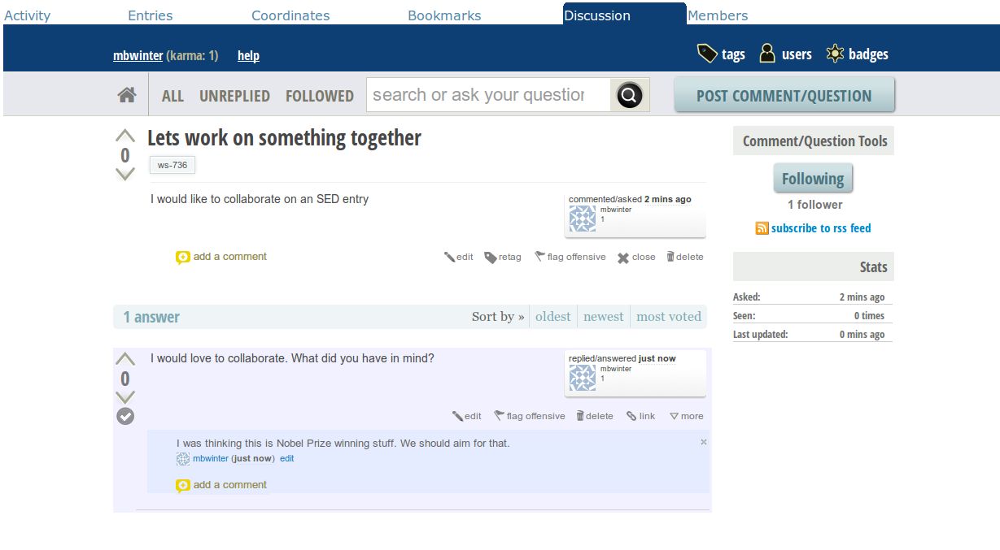
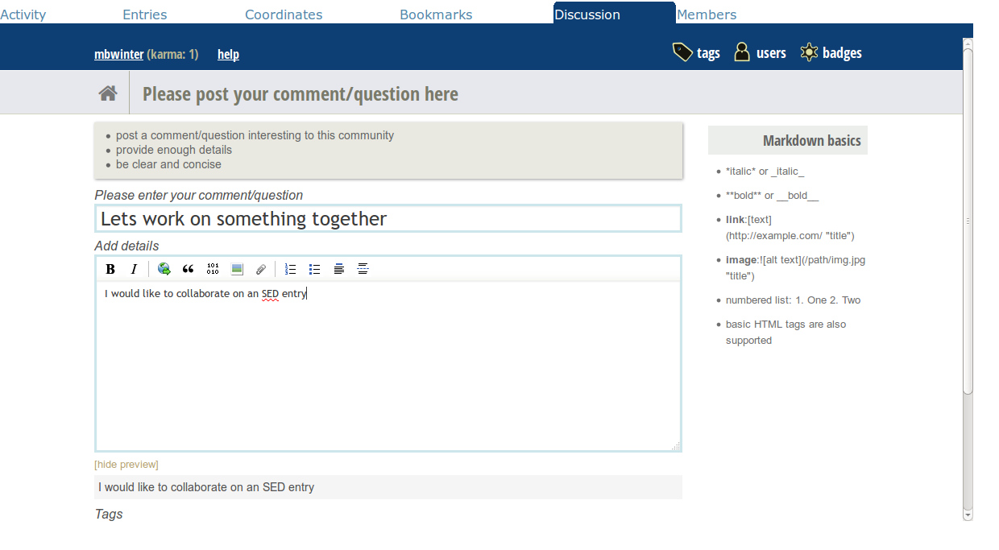
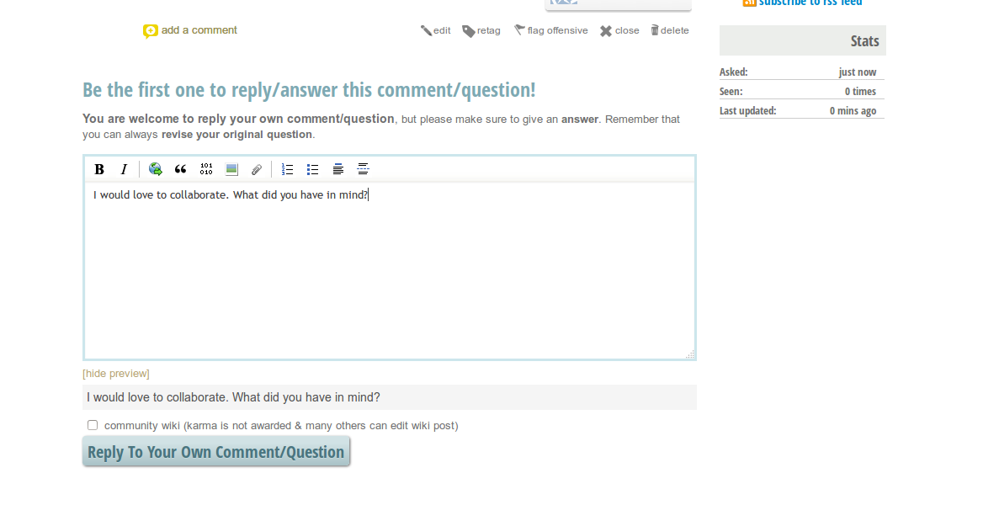
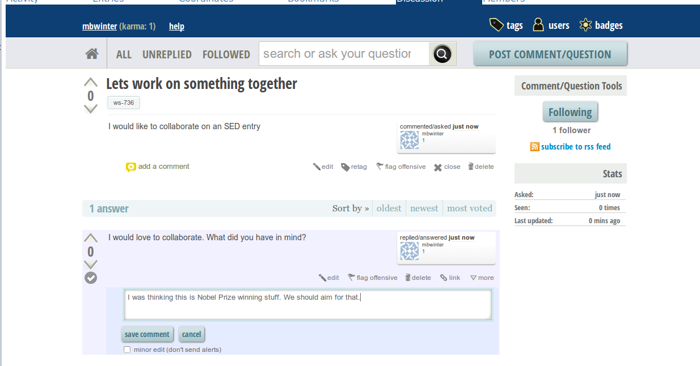

Discussion
==============

For any entry or workspace, there is a forum powered by an application called Askbot.

    Discussion example
    
Starting a Thread
^^^^^^^^^^^^^^^^^

To start a new thread, click on the "Post Comment/Question" button. This question will automatically be tagged with ws-XXX if it is in a workspace or doc-XXX if it is attached to an entry. You can also add custom tags.

For any entry or workspace, there is a forum powered by an application called Askbot.

    Starting a thread
    
Replying to a Thread
^^^^^^^^^^^^^^^^^^^^

When you click on a thread, at the bottom, the user is allowed to respond.

    Replying to a post
    

Commenting
^^^^^^^^^^^^^^^^^^^^

Unlike typical discussion forums, Askbot only allows one response ber user, however, you can comment as much as you like to engage in a proper discussion.

    Commenting
