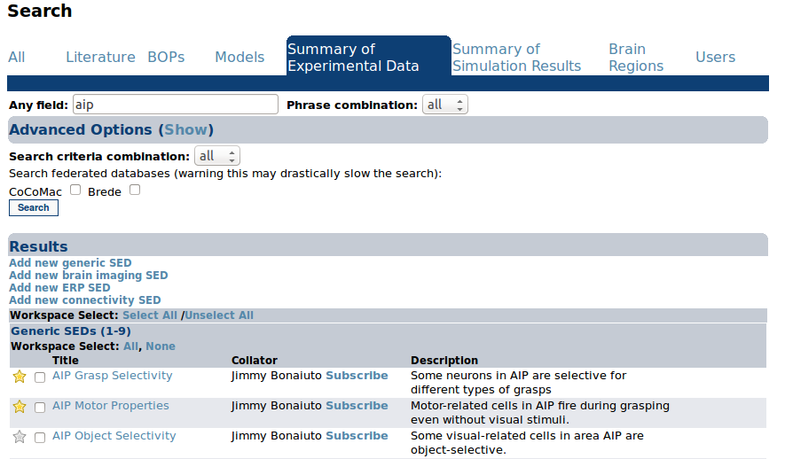
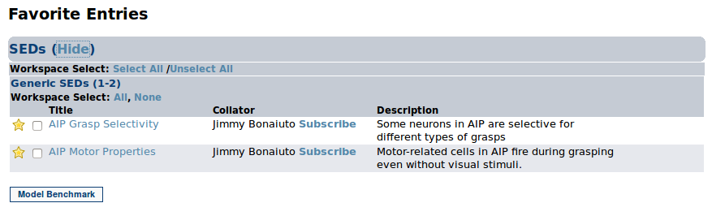
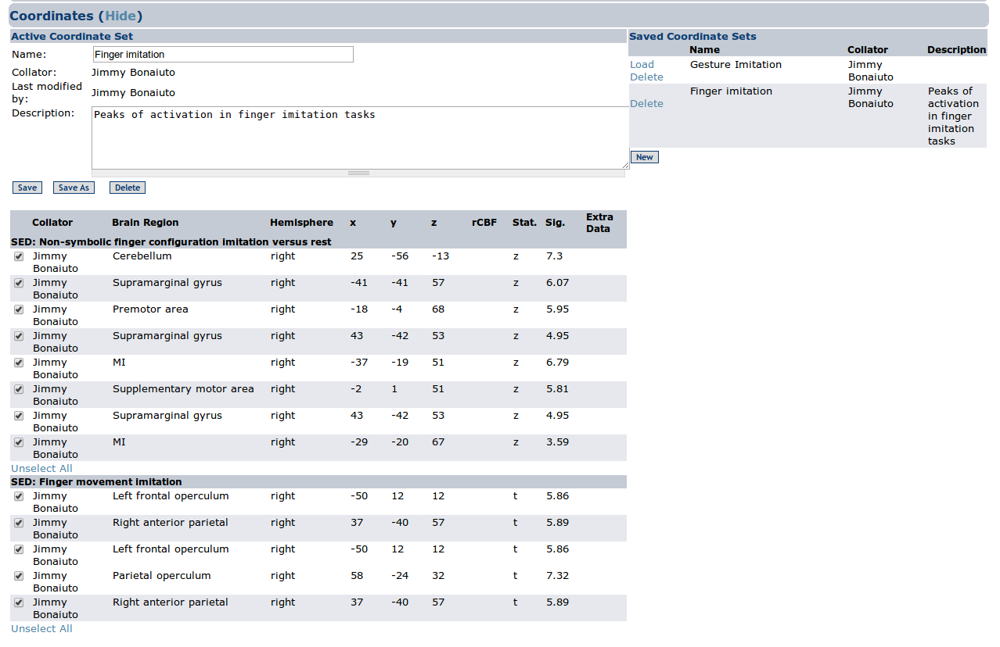

Favorites
==============

Favorites are a way of keeping track of entries of interest to the user. In any list view (e.g., when a search is conducted) the user can check the star on the far left of an entry to add an entry to their favorites.

    Add an entry to a Favorites
    

    The Favorites page

The Favorites page also contains a list of Coordinate Sets created by the user. Any time the user clicks on a checkbox next to a coordinate in a Brain Imaging SED search result it is added to the currently active Coordinate Set. The Active Coordinate Selection section lists the name and description of the currently active selection along with a list of all coordinates in the selection, grouped by the SED that they belong to. The Saved Coordinate Selections section lists all of the coordinate selections saved in this workspace. Users can click Load next to a selection to make it active, or Delete to delete it. Clicking on the New button will clear the currently active coordinate selection so that a new one can be created.

    The Coordinates section of the Favorites page

