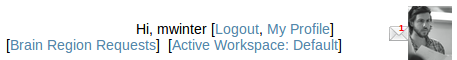
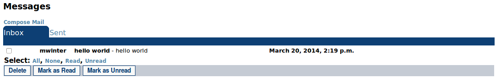
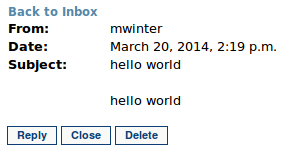
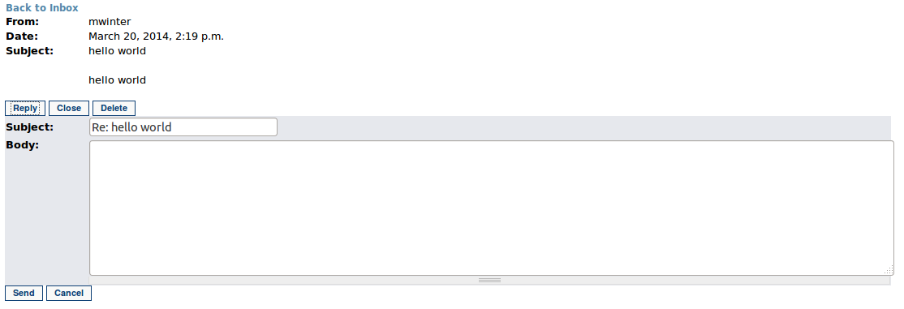
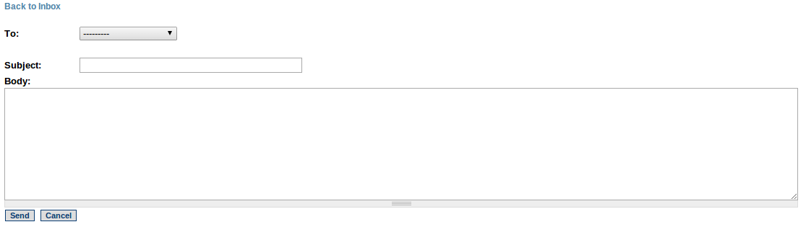

Messages
==============

The BODB messaging system allows users to send and receive message to and from other users. In the top right corner where the currently logged in user is displayed is a mail icon that links to the messages page. When the currently logged in user has unread messages, the mail icon will include a red number notifying the user of the unread messages. 

    The top right corner of the BODB page displays new mail notifications
    
Viewing Messages
^^^^^^^^^^^^^^^^
The Inbox tab of the Messages page lists all messages - read and unread. For each message, the sender is displayed as well as the subject, a portion of the text, and the date and time it was received. After selecting messages by clicking on their checkbox, the user can delete, mark them as read, or mark them as unread by clicking on the appropriate button.

    The Inbox tab of the Messages page

Clicking on a message in the Inbox list will display the message view page containing the entire message. The options available from this screen are "Back to Inbox", "Reply", "Close" or "Delete".

    The message view page

Replying to Messages
^^^^^^^^^^^^^^^^^^^^
Clicking on the "Reply" button on the message view page will display a form for a message reply. Fill in the subject and body and click the "Send" button to send the message or "Cancel" to cancel.

    The message view page while replying

Viewing Sent Messages
^^^^^^^^^^^^^^^^^^^^^
Sent messages can be viewed in the Sent tab of the Messages page. Click on the message in the list to view it in its entirety.

    The Sent tab of the Messages page

Composing a New Message
^^^^^^^^^^^^^^^^^^^^^^^
To compose a new message, click on the "Compose Mail" link on the Messages page. This will display a blank form for writing the message. The "To" drop-down box will contain a list of all the other users in the system. Selecting a user then fill in the subject and body and click "Send" to send the message or "Cancel" to cancel.

    The message compose page

