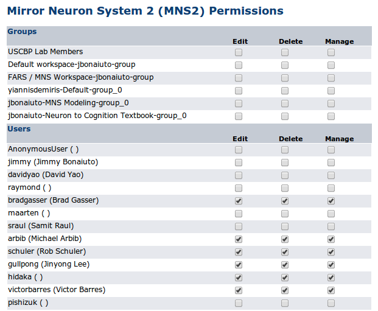

Permissions
===========

Any entry in BODB can be saved as a draft or not, and can be made public. These settings define which users can view the entry, based on the following rules:

* If it's public: Anyone can view it

* If it's a draft: Only the user who created the entry (the collator) and administrators can view it

* Otherwise: The collator, administrators, and users in the same user group as the collator can view it

Actions such as adding a new entry and editing, making public, or deleting an existing entry are defined at the level of entry type. Additionally, users or groups of users can be given permission to edit, delete or manage individual entries.

Entry Type Permissions
----------------------

The possible permissions at the entry type level depend on the type of entry. Possible permissions are:

* Literature

  * Insert, Edit, Delete

* Models

  * Insert, Save, Make public, Edit, Delete

* Modules

  * Insert, Edit, Delete

* BOPs

  * Insert, Save, Make public, Edit, Delete

* SEDs

  * Insert, Save, Make public, Edit, Delete

* SSRs

  * Insert, Save, Make public, Edit, Delete

* Predictions

  * Insert, Save, Make public, Edit, Delete

* Nomenclatures

  * Insert, Edit, Delete

Users with Insert or Edit permissions, but not Save permissions can create entries, but can only save them as a draft. Entry type permissions for users and user groups can be set from the Admin section by editing the user or group:

* User :ref:`edit-user`
* Group :ref:`edit-group`

Group permissions apply to all members of the group, and user permissions override group permissions.

Individual Entry Permissions
----------------------------

Permissions can be defined for each individual entry for users and groups of users. Entry-level permissions override entry type permissions, and user entry-level permissions override user group entry-level permissions.

Possible entry-level permissions:

* Edit - allows a user to edit the entry
* Delete - allows a user to delete the entry
* Manage - allows a user to manage the permissions for the entry

Permissions for a particular entry can be modified by clicking on the "Manage Permissions" button at the bottom of the entry's view page. This option is only available to the user who created the entry, administrators, and any other user given manage permission for the entry.

    Entry-level permission management for a model
