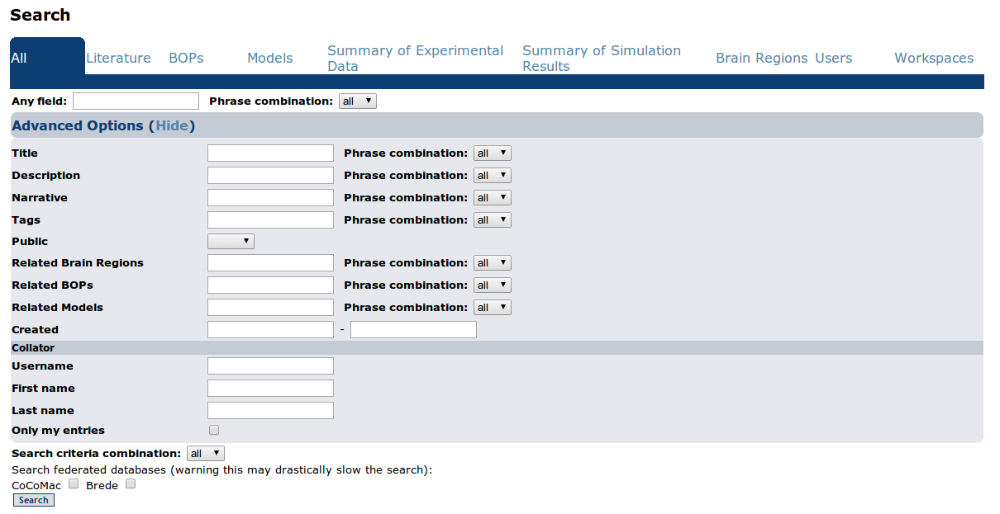
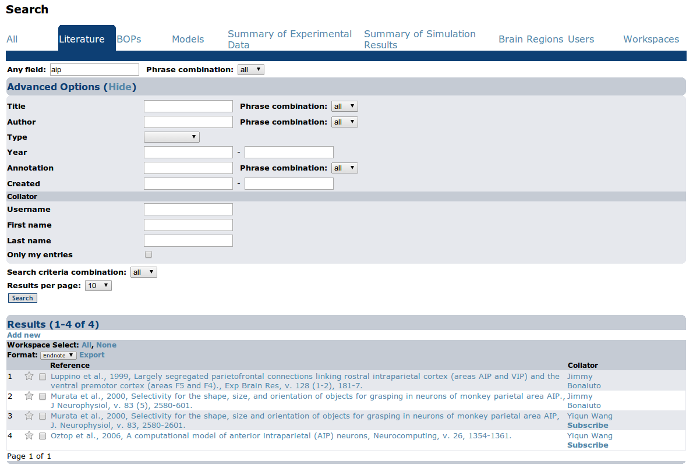
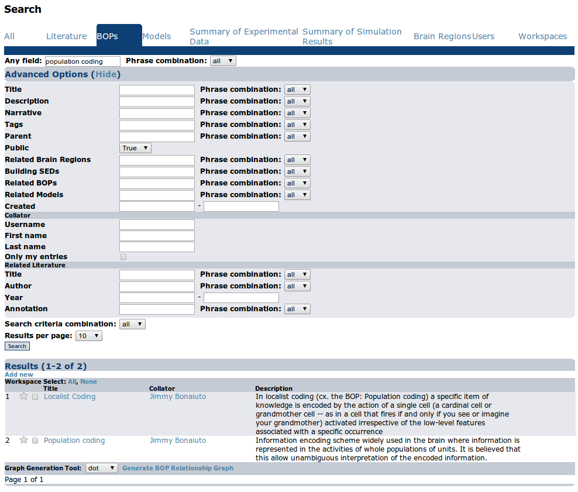
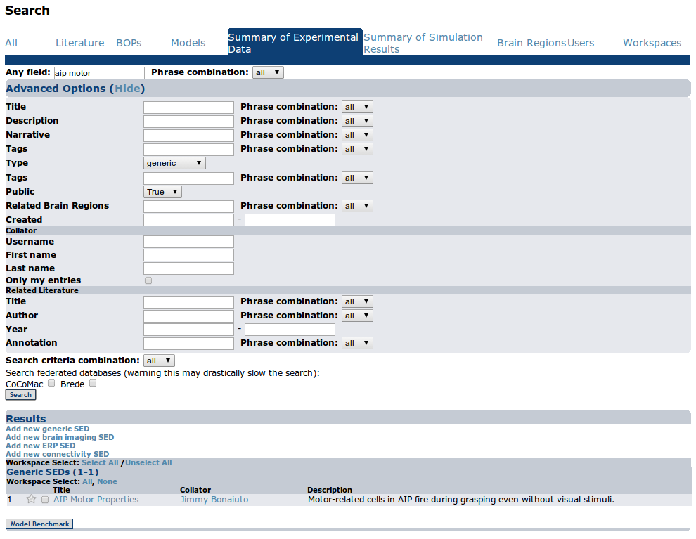
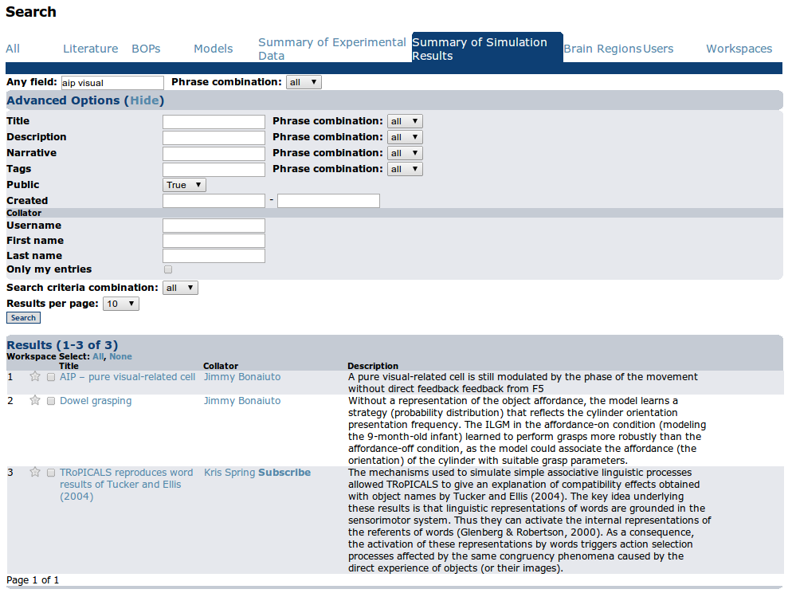
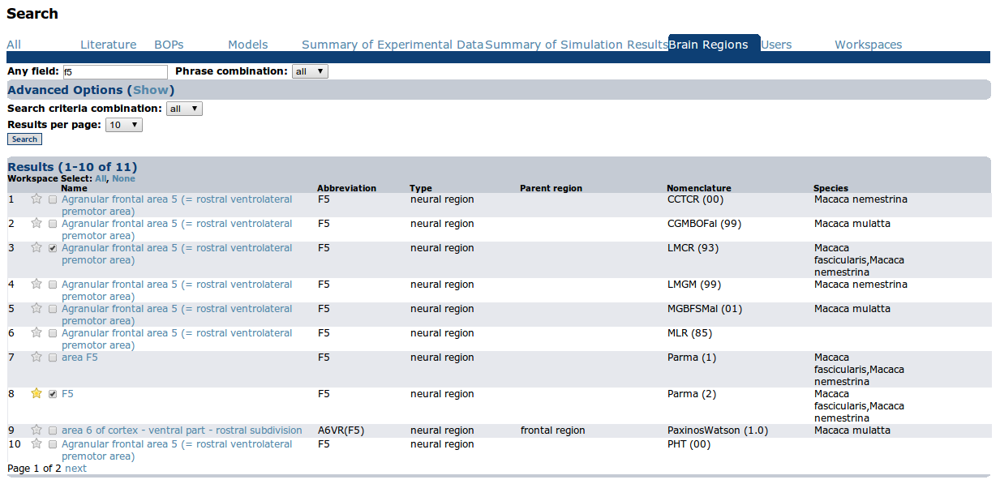
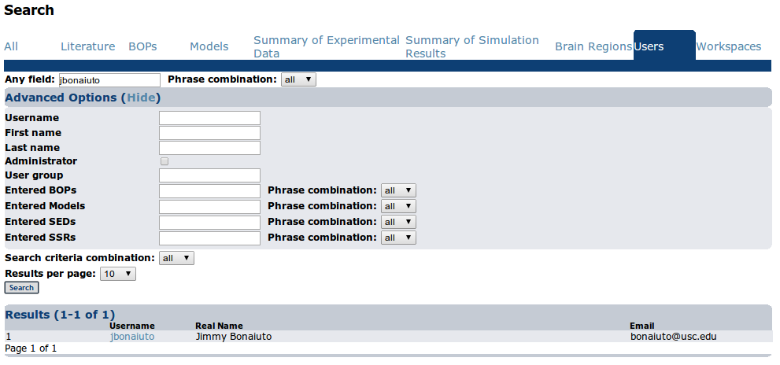

Searching Data
==============

The search page provides tabs for searching all entries, Literature, BOP, Model, SED, SSR, and Brain Region records. It is displayed after clicking on the "Search" link in the main toolbar

All
---
Search for all types of entries.

    The input form for searching all entries

Figure 34: The input form for searching entries.

Multiples phrases can be entered in each text search field by separating them by commas, or enclosing them in quotes. The corresponding Phrase combination field specifies which method to combine phrases with: "any" combines them using OR, "all" combines them using AND

* Any Field - Search for any entry that contains this string in any field.

Advanced Options
^^^^^^^^^^^^^^^^
* Title - Search the title field of any entry
* Description - Search the description field of any entry
* Narrative - Search the narrative field of any entry
* Tags - Search the tags field of any entry 
* Public - Search only public entries
* Created - Search entries created within a date rage
* Collator - Search entries by the Username, First Name, and/or Last Name of the Collator or select to display only the current user's entries

Search Criteria Combination
^^^^^^^^^^^^^^^^^^^^^^^^^^^
Method to use to combine search critera - "any" (OR), or "all" (AND)

Search Federated Databases
^^^^^^^^^^^^^^^^^^^^^^^^^^
Allows the user to search CoCoMac and/or Brede

Results
^^^^^^^
Results are grouped according to the entry type. Individual results are detailed below for the respective entries. 

Literature
----------
Search Literature entries.

    The input form for searching Literature entries

Multiples phrases can be entered in each text search field by separating them by commas, or enclosing them in quotes. The corresponding Phrase combination field specifies which method to combine phrases with: "any" combines them using OR, "all" combines them using AND

* Any Field - Search for Literature entries that contains this string in any field

Advanced Options
^^^^^^^^^^^^^^^^
* Title - Search the title field of Literature entries 
* Author - Search the author field of Literature entries 
* Type - Search for Literature entries of a particular type (Journal, Book, Thesis, Conference, Unpublished) 
* Year - Search for Literature entries in a particular year range 
* Annotation - Search the annotation field of Literature entries 
* Public - Search only public entries
* Created - Search entries created within a date rage
* Collator - Search entries by the Username, First Name, and/or Last Name of the Collator or select to display only the current user's entries

Search Criteria Combination
^^^^^^^^^^^^^^^^^^^^^^^^^^^
Method to use to combine search critera - "any" (OR), or "all" (AND)

Results
^^^^^^^
The results of the Literature search are displayed here. Clicking "Add new" opens a window to add a new Literature entry. Clicking the title of each search result will open a window with the Literature view page. The results can be exported in either Endnote or Bibtex format by clicking the checkbox next to the desired results and clicking "Export Selected".

BOPs
----
Search BOP entries.

    The input form for searching BOP entries

Multiples phrases can be entered in each text search field by separating them by commas, or enclosing them in quotes. The corresponding Phrase combination field specifies which method to combine phrases with: "any" combines them using OR, "all" combines them using AND

* Any Field - Search for BOP entries that contains this string in any field

Advanced Options
^^^^^^^^^^^^^^^^
* Title - Search the title field of BOP entries 
* Description - Search the description field of BOP entries 
* Narrative - Search the narrative field of BOP entries 
* Tags - Search the tags field of BOP entries 
* Parent - Search for BOPs whose parent BOPs contain this string 
* Public - Search only public entries
* Related Brain Regions - Search for BOPs related to the given brain regions 
* Building SEDs - Search for BOPs with Building SEDs containing the given text 
* Related BOPs - Search for BOPs with related BOPs containing the given text 
* Related Models - Search for BOPs with related Models containing the given text 
* Created - Search entries created within a date rage
* Collator - Search entries by the Username, First Name, and/or Last Name of the Collator or select to display only the current user's entries
* Related Literature - Search for BOPs related to Literature by Title, Author, Year, and or Annotation

Search Criteria Combination
^^^^^^^^^^^^^^^^^^^^^^^^^^^
Method to use to combine search critera - "any" (OR), or "all" (AND)

Results
^^^^^^^
The results of the BOP search are displayed here. Clicking "Add new" opens a window to add a new BOP entry. Clicking the title of each search result will open a window with the BOP view page.

Models
------
Search Model entries

.. figure:: images/model_search.png
    :align: center
    :figclass: align-center

    The input form for searching Model entries

Multiples phrases can be entered in each text search field by separating them by commas, or enclosing them in quotes. The corresponding Phrase combination field specifies which method to combine phrases with: "any" combines them using OR, "all" combines them using AND

* Any Field - Search for Model entries that contains this string in any field

Advanced Options
^^^^^^^^^^^^^^^^
* Title - Search the title field of Model entries 
* Author - Search the author field of Model entries 
* Description - Search the description field of Model entries 
* Narrative - Search the narrative field of Model entries 
* Tags - Search the tags field of Model entries 
* Public - Search only public entries
* Building SEDs - Search for Models with Building SEDs containing the given text 
* Testing SEDs - Search for Models with Testing SEDs containing the given text
* Predictions - Search for Models with Predictions containing the given text 
* SSRs - Search for Models with SSRs containing the given text 
* Related Brain Regions - Search for Models related to the given brain regions 
* Related BOPs - Search for Models with related BOPs containing the given text 
* Related Models - Search for Models with related Models containing the given text 
* Created - Search entries created within a date rage
* Collator - Search entries by the Username, First Name, and/or Last Name of the Collator or select to display only the current user's entries
* Related Literature - Search for BOPs related to Literature by Title, Author, Year, and or Annotation

Search Criteria Combination
^^^^^^^^^^^^^^^^^^^^^^^^^^^
Method to use to combine search critera - "any" (OR), or "all" (AND)

Results
^^^^^^^
The results of the Model search are displayed here. Clicking "Add new" opens a window to add a new Model entry. Clicking the title of each search result will open a window with the Model view page. Clicking on the checkbox next to each result will add the Model to the current selection in the workspace.

Summary of Experimental Data
----------------------------

Search Summary of Experimental Data (SED) entries

    The input form for searching SED entries

Multiples phrases can be entered in each text search field by separating them by commas, or enclosing them in quotes. The corresponding Phrase combination field specifies which method to combine phrases with: "any" combines them using OR, "all" combines them using AND

* Any Field - Search for SED entries that contains this string in any field

Advanced Options
^^^^^^^^^^^^^^^^
* Title - Search the title field of SED entries 
* Description - Search the description field of SED entries 
* Narrative - Search the narrative field of SED entries 
* Tags - Search the tags field of SED entries 
* Public - Search only public entries
* Type - Search SED entries by type
* Related Brain Regions - Search for SEDs related to the given brain regions 
* Created - Search entries created within a date rage
* Collator - Search entries by the Username, First Name, and/or Last Name of the Collator or select to display only the current user's entries
* Related Literature - Search for BOPs related to Literature by Title, Author, Year, and or Annotation

Search Criteria Combination
^^^^^^^^^^^^^^^^^^^^^^^^^^^
Method to use to combine search critera - "any" (OR), or "all" (AND)

Search Federated Databases
^^^^^^^^^^^^^^^^^^^^^^^^^^
Allows the user to search CoCoMac and/or Brede

Results
^^^^^^^
The results of the SED search are displayed here. Clicking "Add new" opens a window to add a new SED entry. Clicking the title of each search result will open a window with the SED view page.

    The brain imaging SED search results

Brain Imaging SED results include a list of the coordinates for each SED. Clicking on the checkbox to the left of a coordinate will add it to the currently active Coordinate Set.

Summary of Simulation Results
-----------------------------
Search Summary of Simulation Results (SSR) entries

    The input form for searching SSR entries

Multiples phrases can be entered in each text search field by separating them by commas, or enclosing them in quotes. The corresponding Phrase combination field specifies which method to combine phrases with: "any" combines them using OR, "all" combines them using AND

* Any Field - Search for SSR entries that contains this string in any field

Advanced Options
^^^^^^^^^^^^^^^^
* Title - Search the title field of SSR entries 
* Description - Search the description field of SSR entries 
* Narrative - Search the narrative field of SSR entries 
* Tags - Search the tags field of SSR entries 
* Public - Search only public entries
* Created - Search entries created within a date rage
* Collator - Search entries by the Username, First Name, and/or Last Name of the Collator or select to display only the current user's entries

Search Criteria Combination
^^^^^^^^^^^^^^^^^^^^^^^^^^^
Method to use to combine search critera - "any" (OR), or "all" (AND)

Results
^^^^^^^
The results of the SSR search are displayed here. Clicking "Add new" opens a window to add a new SSR entry. Clicking the title of each search result will open a window with the SSR view page.

Brain Regions
-------------
Search Brain Region entries

    The input form for searching brain region entries

Multiples phrases can be entered in each text search field by separating them by commas, or enclosing them in quotes. The corresponding Phrase combination field specifies which method to combine phrases with: "any" combines them using OR, "all" combines them using AND

* Any Field - Search for Brain Region entries that contains this string in any field

Advanced Options
^^^^^^^^^^^^^^^^
* Name - Search the name field of Brain Region entries 
* Abbreviation - Search the abbreviation field of Brain Region entries 
* Parent - Search for Brain Regions with the given parent region 
* Nomenclature - Search for Brain Regions belonging to the given nomenclature 
* Species - Search for Brain Regions corresponding to the given species 
* Region Type - Search for Brain Regions of the given type (fiber tract, neural region, vesicle) 

Search Criteria Combination
^^^^^^^^^^^^^^^^^^^^^^^^^^^
Method to use to combine search critera - "any" (OR), or "all" (AND)

Results
^^^^^^^
The results of the Brain Region search are displayed here. If the desired brain region is not found, the user can request that a new region be added to the database by clicking the given link. This will display the New Brain Region Request form.

Summary of Simulation Results
-----------------------------
Search Summary of Simulation Results (SSR) entries

    The input form for searching SSR entries

Multiples phrases can be entered in each text search field by separating them by commas, or enclosing them in quotes. The corresponding Phrase combination field specifies which method to combine phrases with: "any" combines them using OR, "all" combines them using AND

* Any Field - Search for SSR entries that contains this string in any field

Advanced Options
^^^^^^^^^^^^^^^^
* Title - Search the title field of SSR entries
* Description - Search the description field of SSR entries
* Narrative - Search the narrative field of SSR entries
* Tags - Search the tags field of SSR entries
* Public - Search only public entries
* Created - Search entries created within a date rage
* Collator - Search entries by the Username, First Name, and/or Last Name of the Collator or select to display only the current user's entries

Search Criteria Combination
^^^^^^^^^^^^^^^^^^^^^^^^^^^
Method to use to combine search critera - "any" (OR), or "all" (AND)

Results
^^^^^^^
The results of the SSR search are displayed here. Clicking "Add new" opens a window to add a new SSR entry. Clicking the title of each search result will open a window with the SSR view page.

Users
-------------
Search Users

    The input form for searching users

Multiples phrases can be entered in each text search field by separating them by commas, or enclosing them in quotes. The corresponding Phrase combination field specifies which method to combine phrases with: "any" combines them using OR, "all" combines them using AND

* Any Field - Search for Users that contains this string in any field

Advanced Options
^^^^^^^^^^^^^^^^
* Username - Search the username field of Users
* First name - Search the first name field of Users
* Last name - Search for the last name field of Users
* Entered BOPs - Search for Users who have entered BOPs with the given keywords
* Entered Models - Search for Users who have entered Models with the given keywords
* Entered SEDs - Search for Users who have entered SEDs with the given keywords
* Entered SSRs - Search for Users who have entered SSRs with the given keywords

Search Criteria Combination
^^^^^^^^^^^^^^^^^^^^^^^^^^^
Method to use to combine search critera - "any" (OR), or "all" (AND)

Results
^^^^^^^
The results of the User search are displayed here. Clicking the username of each search result will open a window with the User view page.
