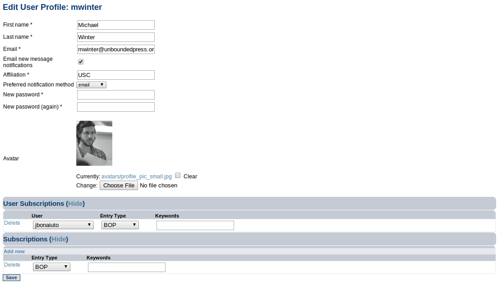

User Profile
============

The user profile page allows users to view and change their BODB preferences and account information.

    The user profile page
    
Profile Settings
----------------

* First name - The user's first name 
* Last name - The user's last name 
* Email - Valid email address where system notifications are to be sent to 
* Email new message notifications - When checked emails will be sent to the email address above alerting the user whenever messages are received in BODB's messaging system 
* Affiliation - The user's institutional affiliation 
* Preferred notification method - Notification can be sent as either emails or messages within BODB or both
* New password - New user password (must be entered twice) 
* Avatar - The user avatar

Subscriptions
-------------

BODB allows users to set up subscriptions to be automatically notified when new entries with certain keywords are added to the system. To add a new subscription, click the "Add new" link in the Subscriptions section. This will add a new subscription row. The Entry Type can be Model, BOP, SED, Prediction, or SSR, and the Keywords field takes a list of keywords separated by spaces. If these keywords appear anywhere in a new entry of the specified type, a notification will be sent to the user using their preferred method.
