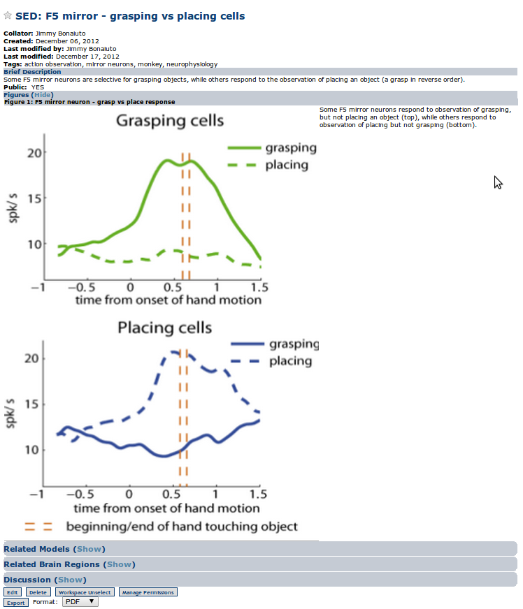

Viewing Entries
===============

When selecting to view an entry (e.g. from a search). You can view an already created entry where you have the choice to add it to the currently active workspace or export it as a number of formats (pdf, rtf, json, and xml are currently supported).

    Detail view of an SED

For explainations of the fields of each entry type, see:

* Literature :ref:`insert-literature`
* Generic BOP :ref:`insert-bop`
* Model :ref:`insert-model`
* Generic SED :ref:`insert-generic-sed`
* Brain Imaging SED :ref:`insert-brain-imaging-sed`
* ERP SED :ref:`insert-erp-sed`
* Connectivity SED :ref:`insert-connectivity-sed`

Drafts
------

When creating a new entry, the user may save their work as a draft. These entries are then listed on the Drafts page. This will allow the user to keep track of unpublished entries that they are working on. These entries can be viewed as detailed above and then further edited until they are ready for publication. If the user does not have permissions to save the entry, they may contact the BODB administrator to gain the proper permissions are have the entry published.

    Drafts page
