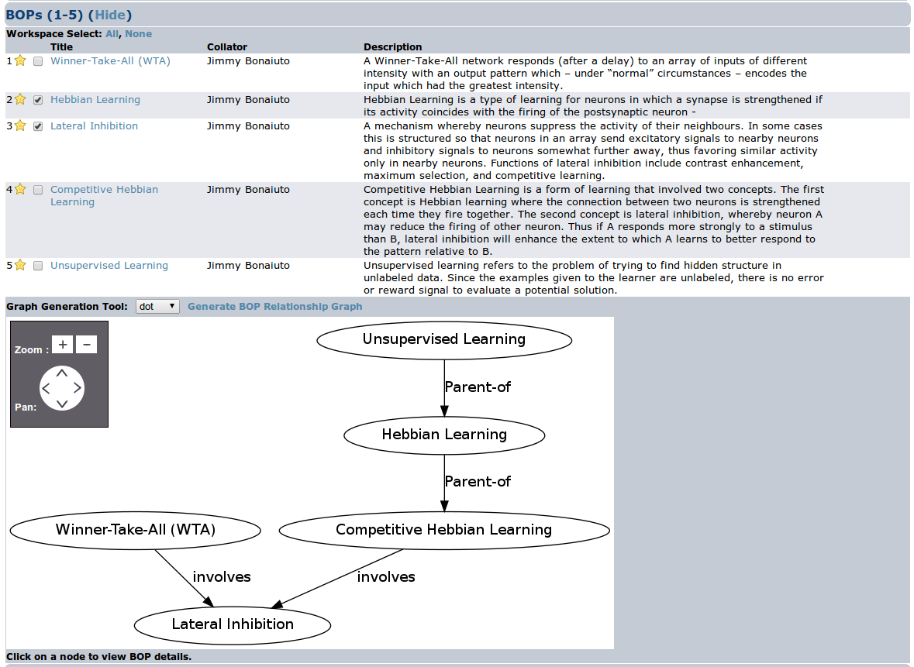
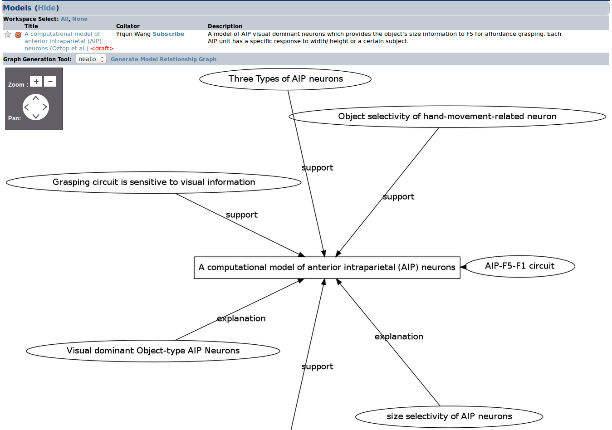
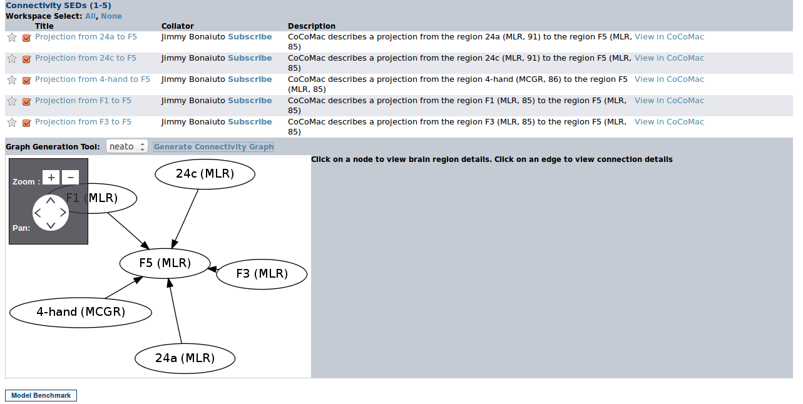
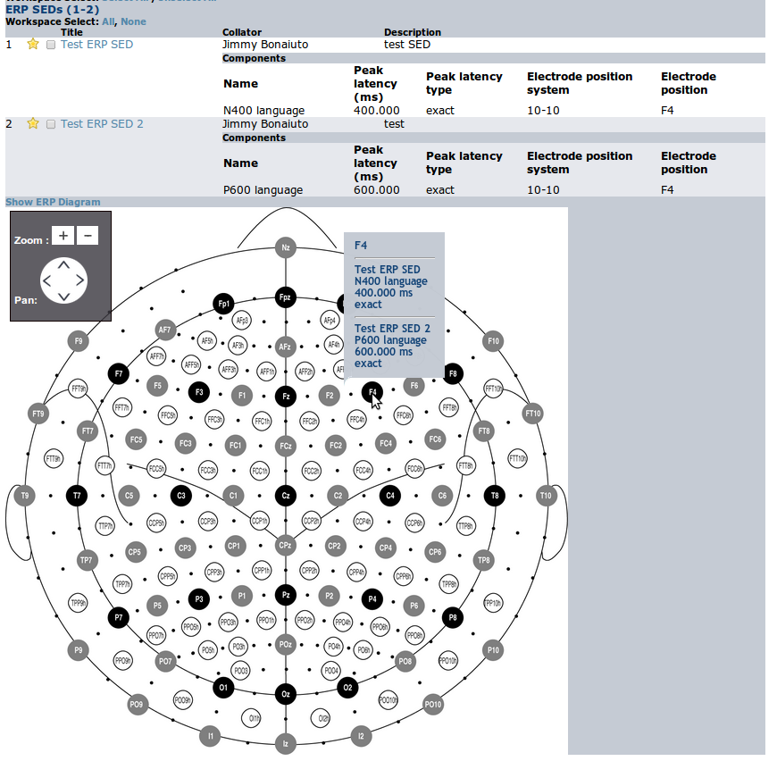

Visualization
=============

Graphs
------

BODB allows users to graph connections between BOPs, Models, and Connectivity SEDs. A link to create these relational
graphs is given in the list view of any such entries. BODB current supports dot, neato, fdp, sfdp, twopi, and circo
graph formats.

BOP Relationship Graph
^^^^^^^^^^^^^^^^^^^^^^
The BOP relationship graph shows parent-child, "involves" and "synonym" relationships between BOPs. Clicking on a BOP
node in the graph will navigate to the view page for that BOP.

    An example of a BOP Relationship Graph

Model Relationship Graph
^^^^^^^^^^^^^^^^^^^^^^^^
Model relationship graphs show models as rectangular nodes and the SEDs used to build or test them as round nodes. Edges
between SED and model nodes are labeled with the SED-Model relationship ("scene setting" or "support" for building SEDs,
"explanation" or "contradiction" for testing SEDs). Clicking on a model or SED node will navigate to the view page for
that entry.

    An example of a Model Relationship Graph

Connectivity SED Graph
^^^^^^^^^^^^^^^^^^^^^^
Connectivity SED graphs show the connections between brain regions defined by a set of connectivity SEDs. Each brain region
is represented by a round node labeled with the brain region abbreviation and abbreviated nomenclature in parenthesis. Clicking
on a brain region node will navigate to the view page for that region, and clicking on an edge will navigate to the view
page for the connectivity SED representing that connection.

    An example of a SED Connectivity Graph

ERP SEDs
--------
Visualizations of ERP SED locations can be generated from lists of ERP SEDs by clicking on the link at the bottom of lists
of these entries. Hovering the mouse over an electrode location will display a tooltip with the ERP components in the list
at that location.

    An example of a visualization of ERP SEDs

BrainSurfer
-----------
Sets of selected SED coordinates can be visualized in BrainSurfer, the latest in a series of efforts to visualize
neuroscientific data from various experiments. BrainSurfer combines three-dimensional visualization functionality with
features such as region search, export functionality, and integration with BODB for data management. Crucially, it adds
extensibility for multiple brain atlases: it can be used to search and view any brain for which a coordinate space and
nomenclature is provided in an appropriate framework.

    Main components of the BrainSurfer user interface

BrainSurfer’s main screen section contains slices through the brain at three orientations – axial, coronal, and sagittal, with images from the selected brain atlas on each slice. The slice planes can be clicked and dragged, updating the slice image as they move. Users can left-click and drag regions outside of the slice planes to rotate the brain, right-click and drag to translate it, and use the mouse wheel to zoom. The reference axes rotate along with the brain. The View Controls section allows users to select which atlas to view, modify the view angle and axes, tooltips, and slice visibility, and export the visualization in a report or image. The Brain Region Browser allows users to browse the brain regions defined in the currently selected axis, and select which ones appear in the visualization. The SED Coordinate Browser lists the SED coordinates in the user’s currently active coordinate set in BODB. When an object is clicked on, the Selected Object Controls shows its current attributes and allows users to modify them. When a slice is selected, the Selected Object Controls section allows the user to modify its position using the slider control, and turn on and off the visibility of the coordinate labels along the corresponding axis.

Clicking on the checkbox next to a brain region in the Brain Region Browser makes the region visible in the main screen and opens its visualization attributes in the Selected Object Controls section. Users can adjust the transparency and color of the region by using the appropriate slider controls. Clicking on the “Show 3D” checkbox toggles between visualizing the brain region in three dimensions as an isosurface mesh or as a two-dimensional shaded area on the brain slices. Brain region definitions are hierarchical and clicking on the checkbox next one will make it and its child regions visible.

    Three-dimensional visualization of brain regions in BrainSurfer using the MNI atlas

    Two-dimensional visualization of brain regions in BrainSurfer using the MNI atlas

When opened, BrainSurfer connects to BODB and loads the user’s active coordinate set. These coordinates appear in the three-dimensional display as red cubes by default. Users can click on a coordinate in the SED Coordinate Browser to change the transparency, color, and shape in the Selected Object Controls section. Clicking on the checkbox next to a coordinate will toggle its visibility. Clicking on an SED in the SED Coordinate Browser allows the user to change the visualization attributes of all the coordinates in that SED simultaneously by using the controls in the Selected Object Controls section.

    Visualization of SED coordinates in BrainSurfer using the MNI atlas

BrainSurfer can be used to visualize data in multiple brain atlases, and where appropriate transformations are available, will automatically transform coordinates between coordinate spaces. Selecting at atlas in the dropdown box of the View Controls section will change the atlas. In addition to the MNI and Talairach human brain atlases, BrainSurfer contains the Paxinos-Watson macaque brain atlas. Future development plans for BODB and BrainSurfer include visualization of macaque neurophysiology and connectivity data.

    Visualization of SED coordinates in BrainSurfer using the Talairach atlas

    Visualization of the Paxinos-Watson macaque brain atlas in BrainSurfer
