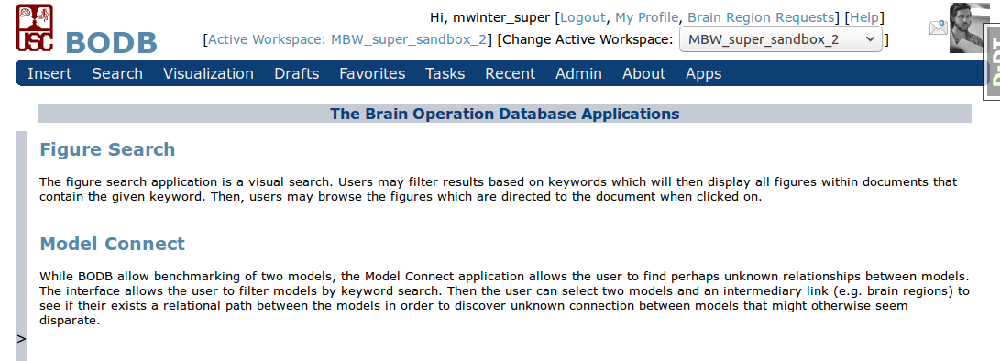
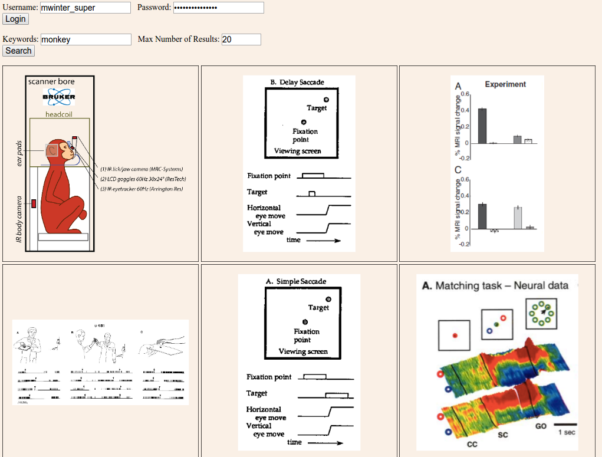
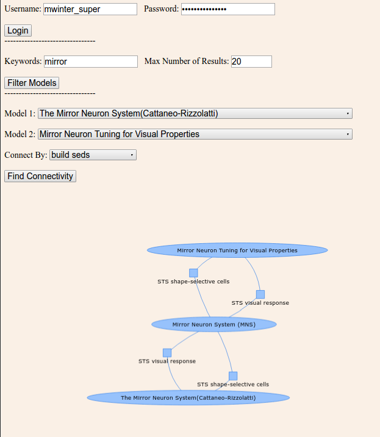

Web API
==============

In order to make BODB's data more accessible to the computer science community and less dependent on BODB's web front end, a full fledged API has been built which allows users to access BODB's data programmatically as well as build custom web applications with no dependence on the BODB front end. In addition, we have created example applications to show the functionality of the new API. The URL protocol, usage documentation, and overview of the applications is provided below

URL Protocol
------------

The BODB web API allows entries and sets of entries to be returned in JSON format through a simple URL protocol. Below we will demonstrate how to use the API by using curl calls as well as JavaScript applications.

* bodb.usc.edu/bodb/api/v1/
    * document/
    * bop/
    * model/
    * sed/
    * erp_sed/
    * brain_imaging_sed/
    * connectivity_sed/
    * test_sed/
    * build_sed/
    * sed_coord/
    * threed_coord/
    * erp_component/
    * ssr/
    * prediction/
    * brain_region/
    * related_bop/
    * related_model/
    * related_brain_region/
    * document_figure/
    * user/login
    * user/logout

Authenticating Through The API
--------------------------

User are required to be authenticated before they can access data through the API. This is first done by logging in through the API.

.. code-block:: json

    curl -X POST -H "Content-Type: application/json" -d '{"username":"username", "password":"password"}' --verbose http://bodb.usc.edu/bodb/api/v1/user/login/
    
All further calls will require the csrf token and session id from the authentication. When the above line is run in the terminal. You will see these values in the response. Here is an example:

.. code-block:: json

    * upload completely sent off: 52 out of 52 bytes
    < HTTP/1.1 200 OK
    < Date: Fri, 26 Aug 2016 01:25:05 GMT
    < Server: Apache/2.2.12 (Ubuntu)
    < Vary: Accept,Cookie
    < Set-Cookie:  csrftoken=q4jeDYFklZI7NTFTkskYYKSjGjZ07InX; expires=Fri, 25-Aug-2017 01:25:05 GMT; Max-Age=31449600; Path=/
    < Set-Cookie:  sessionid=adboonzsrwzcoml9rkuwvh3h8yu524d0; expires=Fri, 09-Sep-2016 01:25:05 GMT; httponly; Max-Age=1209600; Path=/
    < Transfer-Encoding: chunked
    < Content-Type: application/json

    
Getting Data Through The API
------------------------------------------------

Once the user is authenticated, data can be retreived from any of the following end points using a GET command that includes the csrf token and the session id with ?format=json appended to the endpoint. For example, to get an SED using the tokens above, the user must add /documentid/ to the endpoint.

.. code-block:: json

    curl -X GET -H "Content-Type: application/json" -H "X-CSRFToken:q4jeDYFklZI7NTFTkskYYKSjGjZ07InX" --cookie "sessionid=adboonzsrwzcoml9rkuwvh3h8yu524d0;csrftoken=q4jeDYFklZI7NTFTkskYYKSjGjZ07InX" --verbose http://bodb.usc.edu/bodb/api/v1/sed/26147/?format=json
    
This will return:

.. code-block:: json
    
    {"brief_description": "The experiment (Ding & Gold, 2010) shows that the caudate activity tended to peak during the Stim epoch, and maintained coherence modulation until the saccade.", "collator": "/bodb/api/v1/user/631/", "creation_time": "2015-04-05T00:44:06", "draft": 0, "id": 26147, "last_modified_by": "/bodb/api/v1/user/31/", "last_modified_time": "2015-06-30T17:44:22", "narrative": "In the experiment of decision-discrimination task, the average activity of the caudate neurons did not appear to rise to a common value just before saccade onset. This observation was confirmed by several quantitative measures. First, population activity in the Sac epoch remained weakly modulated by coherence for IN trials. Second, activity of both the population and individual neurons tended to be positively modulated by coherence throughout the Stim epoch, regardless of whether the data were aligned to stimulus or saccade onset. Third, the same analyses were conducted but the data grouped by RT, not coherence. It was found* Connection #0 to host bodb.usc.edu left intact that a primarily negative relationship between RT and Stim epoch activity aligned to response onset.", "public": 1, "related_brain_regions": [{"brain_region": {"abbreviation": "Cd", "brain_region_type": "neural region", "id": 23146, "name": "caudate n.", "resource_uri": "/bodb/api/v1/brain_region/23146/"}, "id": 23937, "relationship": "The average activity of the caudate neurons did not appear to rise to a common value just before saccade onset.", "resource_uri": "/bodb/api/v1/related_brain_region/23937/"}], "resource_uri": "/bodb/api/v1/sed/26147/", "title": "Evidence accumulation activity in the Stim epoch", "type": "generic"}
    
To get a list of documents, simply drop the id. This will automatically return the first 20 results, but adding a ?limit=X will return more. For example, to retrieve 30 SEDs, the following call can be made:

.. code-block:: json

    curl -X GET -H "Content-Type: application/json" -H "X-CSRFToken:q4jeDYFklZI7NTFTkskYYKSjGjZ07InX" --cookie "sessionid=adboonzsrwzcoml9rkuwvh3h8yu524d0;csrftoken=q4jeDYFklZI7NTFTkskYYKSjGjZ07InX" --verbose http://bodb.usc.edu/bodb/api/v1/sed/?format=json&limit=30
    
    
Putting Data Through the API
------------------------------------------------
    
If the user has the permission to create documents, they can use a POST call to enter in the fields. The fields are all the same as the fillable web forms in the BODB front end. For example, the following call can be used to add a simple SED:

.. code-block:: json

    curl -X POST -H "Content-Type: application/json" -H "X-CSRFToken:q4jeDYFklZI7NTFTkskYYKSjGjZ07InX" --cookie "sessionid=adboonzsrwzcoml9rkuwvh3h8yu524d0;csrftoken=q4jeDYFklZI7NTFTkskYYKSjGjZ07InX" --data '{"brief_description": "TEST API POST", "draft": 1, "narrative": "", "public": 0, "related_brain_regions": [], "title": "TEST API POST", "type": "generic"}' --verbose http://localhost:8000/bodb/api/v1/sed/
    
Note that, like on the BODB frontend, adding related documents such as Related BOPs, Models, and SEDs is a two step process. Both entities must by posted and then the link made as follows:

.. code-block:: json

    example link.
    
Search
----------

Each endpoint also come with search functionality that allows the user to do keyword searches. For example, the following call returns the first 20 seds that contain the abbreviation 'AIP'.

For example:

.. code-block:: json

    curl -X GET -H "Content-Type: application/json" -H "X-CSRFToken:q4jeDYFklZI7NTFTkskYYKSjGjZ07InX" --cookie "sessionid=adboonzsrwzcoml9rkuwvh3h8yu524d0;csrftoken=q4jeDYFklZI7NTFTkskYYKSjGjZ07InX" --verbose http://bodb.usc.edu/bodb/api/v1/sed/?format=json&q=aip
    

Creating Applications
-------------------------

The true power of the API is the ability to create third party apps. The developers of BODB have created 2 example apps that are now linked to the new apps page on bodb. The two apps are described in detail below. The code can be viewed at http://www.github.com/uscbp/bodb_apps

    Apps Page
 
Logging In and Getting Data Using JavaScript
----------------------------------------------
    
An example login using JavaScript taken from the Figure Search app below is:

.. code-block:: JavaScript

    function login(username, password) {
        $.ajax({
            url: '/bodb/api/v1/user/login/',
            type: 'POST',
            beforeSend: function(xhr) {
              xhr.setRequestHeader( "Content-type", "application/json" );
            },
            data: JSON.stringify({
                "username": username,
                "password": password
            }),
            success: function() {
                //alert('Test');
                //getData().done(handleData);
            },  
            error: function(errorThrown){
                alert('Login Failed');
            }
        });
    }
    
Then to fetch data:

.. code-block:: JavaScript

    function getData(keywords, limit) {
        return $.ajax({
            url: 'http://bodb.usc.edu/bodb/api/v1/document_figure/search/?format=json&q='+keywords+'&limit='+limit,
            type: 'GET',
            xhrFields: {
              withCredentials: true
            },
            beforeSend: function(xhr) {
              xhr.setRequestHeader( "Content-type", "application/json" );
            }
        });
    }
    

Note that the field xhrFields is passed with Credentials which passes the authentication information that needed to be set manually above with CURL calls.

Figure Search
----------------

The figure search application is a visual search. Users may filter results based on keywords which will then display all figures within documents that contain the given keyword. Then, users may browse the figures which are directed to the document when clicked on.

    Figure Search Application
    

Model Connect
----------------

While BODB allow benchmarking of two models, the Model Connect application allows the user to find perhaps unknown relationships between models. The interface allows the user to filter models by keyword search. Then the user can select two models and an intermediary link (e.g. brain regions) to see if their exists a relational path between the models in order to discover unknown connection between models that might otherwise seem disparate. 

    Model Connect Application
    

