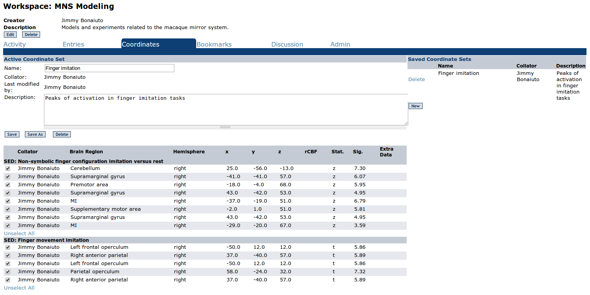

Workspaces
==============

In BODB, we have introduced the idea of Collaborative Workspaces (CoWos) to fascilitate collaboration and sharing of ideas. The workspace page allows a user to view and create any number of workspaces.

    Workspace page
    
Selecting and Creating Workspaces
---------------------------------
    
Selecting a Workspace
^^^^^^^^^^^^^^^^^^^^^

Clicking on the radio button next to a workspace will make that workspace the active workspace. In the top right hand corner, the user information displays the active workspace.

New Workspace
^^^^^^^^^^^^^

Clicking new will allow the user to add a workspace provided a Title and Description.

    Add a Workspace

Adding an Entry to a Workspace
------------------------------

In any list view (e.g., when a search is conducted) the user can check the second box from the left to add an entry to the currently active Workspace.

Clicking new will allow the user to add a workspace provided a Title and Description.

    Add an entry to a Workspace

Workspace Tabs
--------------

Clicking the Workspace in the list view or in the user information to the top right will direct the user to that particular Workspace where there are tabs for Activity, Entries, Coordinates, Bookmarks, Discussion, and Admin.

Activity
^^^^^^^^

The Activity tab will show the activity of all users actions on a given Workspace.

    Workspace Activity tab

Entries
^^^^^^^^

The Entries tab will show all entries that have been added to the Workspace.

    Workspace Entries tab

Coordinates
^^^^^^^^^^^

Lorem ipsum...

    Workspace Coordinates tab
    
Bookmarks
^^^^^^^^^

The bookmarks tab allows users to store urls that are relevant to the Workspace by adding a Title, URL, and Description 

    Workspace Bookmarks tab

Discussion
^^^^^^^^^^

The Discussion tab allows users assigned to a workspace to maintain a thread of relevant discussion. To post a new thread, simply enter text in the textfield and the click Post. To reply to a given thread, press the Reply buttonand then post the reply.

    Workspace Discussion tab
    
Admin
^^^^^
The Admin tab allows the creator of the Workspace to invite other users to participate in the CoWo.

    Workspace Admin tab
